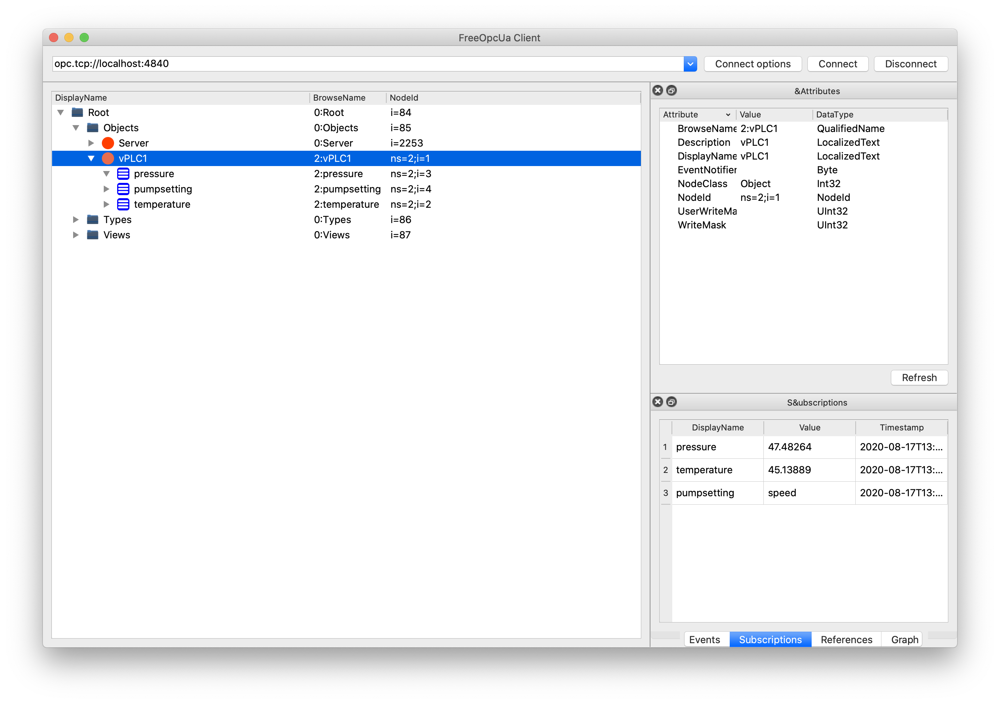

# OPC UA Simulation Server

This is an OPC UA simulation server written in Python, which sends out 3 values from a real data set when it gets started. It is intended for testing, especially with the Cisco Edge Intelligence IoT software for data extraction.

## Installation

1. Download or clone all files

`git clone https://github.com/flopach/opc-ua-sensor-simulator`

2. Install required Python packages

`pip install -r requirements.txt`

3. Run the script (Port **4840** needs to be open!):

`python opc-ua-server.py`

## Sensor Data

When executed, the OPC UA server provides 3 values to the connected clients (infinite loop):

* Pump Temperature (in Fahrenheit), Float
* Pump Pressure (in bar), Float
* Pump Setting (standard or speed), String 

The data set [Pump sensor data](https://www.kaggle.com/nphantawee/pump-sensor-data) which is available on Kaggle is being used.

## Testing

You can test the server immediately by using any OPC UA Client. For example: [Simple Python OPC-UA GUI client](https://github.com/FreeOpcUa/opcua-client-gui)

## License

This python script is licensed under the LGPL-3.0 License - see the [LICENSE.md](LICENSE.md) file for details.

## Further Links

* [Cisco DevNet Website](https://developer.cisco.com)
* [Cisco Edge Intelligence on DevNet](https://developer.cisco.com/edge-intelligence/)
* [Free OPC UA Project](https://github.com/FreeOpcUa)